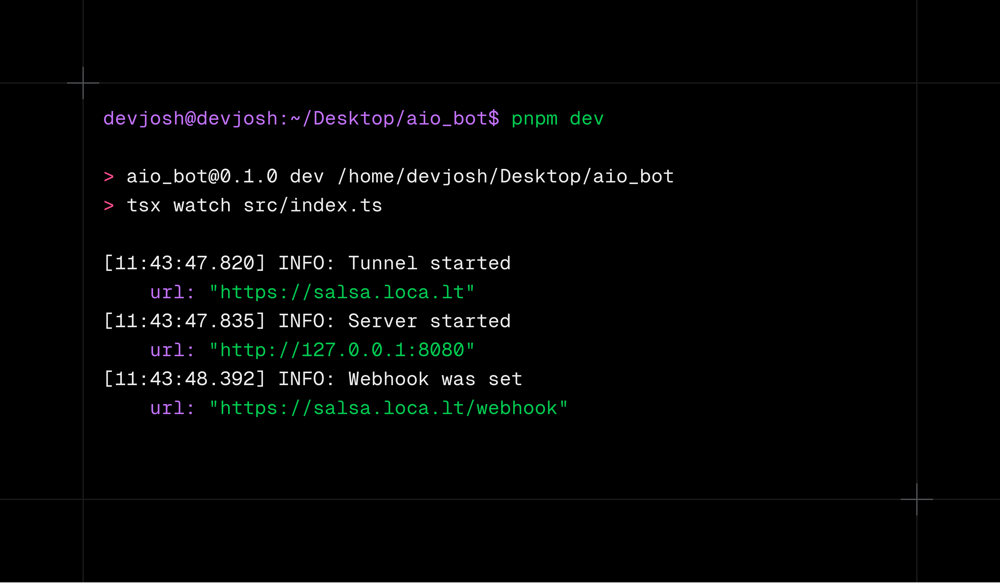

# Grammy Hono Starter Template
[](https://deepwiki.com/ahsoj/grammy-hono-starter-template)



A modern, feature-rich Telegram bot starter template using [grammY](https://grammy.dev/) with [Hono](https://hono.dev/) as a lightning-fast server framework. Built with TypeScript and a structured project layout to get you building amazing bots quickly.

## ✨ Features

-   **🤖 Modern Bot Framework**: Powered by [grammY](https://grammy.dev/), a powerful and easy-to-use Telegram bot framework.
-   **🚀 Blazing Fast Server**: Uses [Hono](https://hono.dev/) for high-performance webhook handling, deployable on various platforms including serverless environments.
-   **🔒 Type-Safe & Robust**: Written entirely in TypeScript with strict mode enabled. Environment variables are validated using [Valibot](https://valibot.dev/).
-   **🌍 Internationalization (I18n)**: Built-in support for multiple languages using `@grammyjs/i18n` with Fluent (`.ftl`) files.
-   **🛠️ Developer-Friendly**:
    -   Hot-reloading in development with `tsx`.
    -   Automatic webhook tunneling for local development using `localtunnel`.
    -   Structured and pretty logging with [Pino](https://getpino.io/).
-   **🗂️ Modular Structure**: A clean and organized codebase that is easy to navigate and extend.
-   **✅ Pre-configured Features**: Includes session management, admin-only commands, command localization, and graceful shutdown.

## 🚀 Getting Started

### Prerequisites

-   [Node.js](https://nodejs.org/) (v18 or higher)
-   [pnpm](https://pnpm.io/) (recommended package manager)
-   A Telegram Bot Token from [@BotFather](https://t.me/BotFather)

### 1. Installation

Clone the repository and install the dependencies:

```bash
git clone https://github.com/ahsoj/grammy-hono-starter-template.git
cd grammy-hono-starter-template
pnpm install
```

### 2. Configuration

Copy the example environment file and fill in your bot's details.

```bash
cp .env.example .env
```

Now, open the `.env` file and add your specific configuration.

```ini
# Bot credentials from @BotFather
BOT_TOKEN=<bot-token>
BOT_ID=<bot-id>
BOT_NAME=<bot-name>
BOT_USERNAME=<bot-username without @>

# Your bot admins' Telegram user IDs (as a JSON array)
BOT_ADMINS=[123456789]

# Localtunnel subdomain for development webhook
# This will create a URL like https://your-subdomain.loca.lt
TUNNEL_SUBDOMAIN=your-subdomain

# Webhook configuration (the template handles generating the full URL)
BOT_WEBHOOK_PATH="/webhook"
BOT_WEBHOOK_SECRET=<generate a secure random string, e.g., with 'openssl rand -hex 32'>

# Server configuration
SERVER_HOST=localhost
SERVER_PORT=8080

# Logging and debug mode
LOG_LEVEL=debug
DEBUG=true
```

> **Note**: The `BOT_WEBHOOK_URL` and `DOMAIN` variables are automatically constructed based on the `TUNNEL_SUBDOMAIN` when in debug mode. You only need to set them for production environments where you have a static public URL.

### 3. Running the Bot

Start the bot in development mode. This will start the Hono server, set up a `localtunnel` for your webhook, and automatically update the webhook on Telegram.

```bash
pnpm dev
```

You should see logs indicating that the server, tunnel, and webhook are active. Your bot is now running!

### Production

To build and run the bot for production:

```bash
# 1. Build the TypeScript source
pnpm build

# 2. Start the bot
pnpm start
```

## 📂 Project Structure

```
.
├── src/
│   ├── bot/
│   │   ├── handlers/     # Message, command, and error handlers
│   │   ├── helpers/      # Utility functions for the bot
│   │   ├── middlewares/  # Custom grammY middlewares
│   │   ├── server/       # Hono server setup and management
│   │   ├── context.ts    # Custom context type for the bot
│   │   ├── i18n.ts       # Internationalization configuration
│   │   └── init.ts       # Bot initialization and middleware setup
│   ├── config.ts       # Environment variable loading and validation (Valibot)
│   ├── index.ts        # Main application entry point
│   └── logger.ts       # Pino logger configuration
├── locales/            # Fluent (.ftl) files for i18n
├── .env.example        # Environment variable template
├── package.json
└── tsconfig.json
```

## 🤖 Bot Commands

-   `/start` & `/help` - Displays the welcome message.
-   `/language` - Opens a menu to change the bot's language (for private chats).
-   `/setcommands` - **(Admin Only)** Updates the bot's command list on Telegram with localized descriptions.

## 📝 License

This project is licensed under the **MIT License**. See the `LICENSE` file for details.
